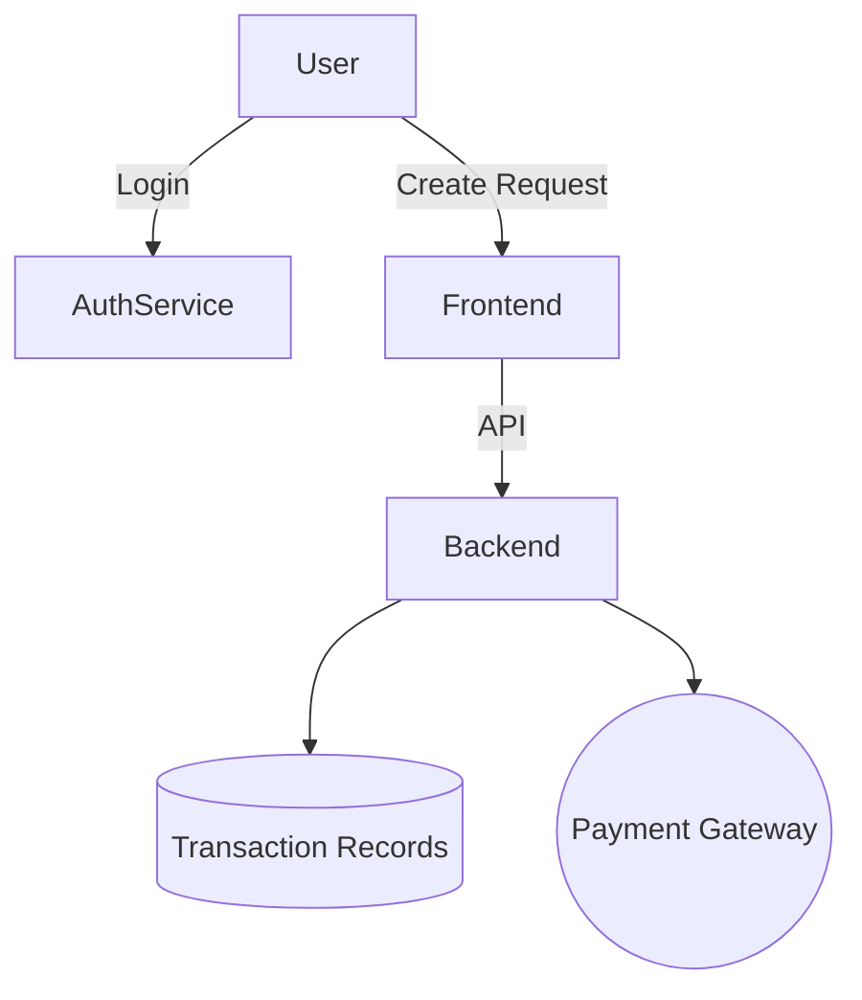

# WeShare

*A simple peer-to-peer payment platform for requesting, tracking, and processing payments between users.*

##  Overview

WeShare makes it easy to **request and settle small payments** between friends, family, or groups. Whether you’re splitting a bill, paying for coffee, or tracking borrowed money, WeShare provides a seamless way to log requests and process payments securely.

Example:
If a friend borrows **R10 for coffee**, you can log the transaction in WeShare. Your friend receives a request notification and can **settle the payment directly in the app**.

##  Features

*  **User Accounts** – secure login and personalized profiles.
*  **Payment Requests** – send and receive money requests instantly.
*  **Notifications** – stay updated on pending and completed payments.
*  **Transaction History** – track who owes what, and see past settlements.
*  **Secure Payments** – end-to-end encryption for safe transfers.
*  **Multi-currency Support** (future) – designed to expand beyond local currency.

## Tech Stack

* **Frontend:** React Native / Flutter (for cross-platform app UI)
* **Backend:** Node.js / Django / Express
* **Database:** PostgreSQL / MongoDB / Firebase
* **Payment Processing:** Stripe / PayPal / (or custom integration with local banks)
* **Authentication:** JWT / OAuth2


## System Architecture



##  Use Cases

* Splitting bills at restaurants.
* Paying back borrowed cash (coffee, taxi, groceries).
* Group expenses (travel, events, clubs).
* Community contributions and donations.

##  Future Improvements

*  QR code payments.
*  Cross-border remittances.
*  Virtual cards integration.
*  Smart reminders for unpaid requests.
*  Support for digital currencies / Web3 wallets.

## Installation & Setup

```bash
# Clone the repository
git clone https://github.com/your-username/weshare.git

# Navigate into the project
cd weshare

# Install dependencies
npm install   # or pip install -r requirements.txt

# Run the app
npm start     # or flutter run
```

## Contributing

We welcome contributions! Fork the repo, make your changes, and open a pull request.

## 📜 License

This project is licensed under the MIT License – see the [LICENSE](LICENSE) file for details.

---
